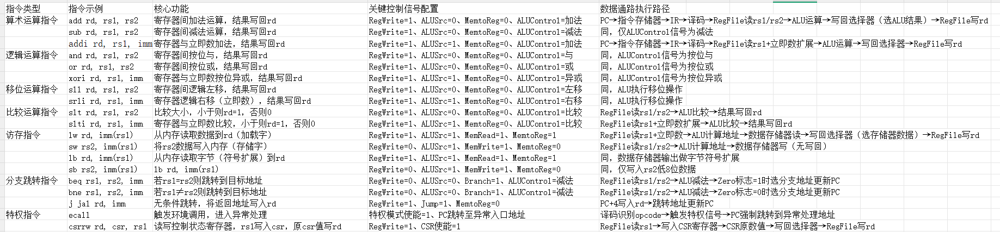

1. Git & GitHub 版本控制学习
完成 Git 基础命令学习，包括 git init 、 git add 、 git commit 、 git push / pull 等操作，掌握分支创建（ git branch ）、切换（ git checkout ）与合并（ git merge ）的基本流程。
成功在 GitHub 上创建个人代码仓库，理解远程仓库与本地仓库的关联逻辑，学会通过gitignore文件过滤无需上传的文件。

2. 龙芯单周期 CPU 20 条指令 Verilog 开发
基于龙芯指令集架构，梳理 20 条核心指令（涵盖算术运算、逻辑运算、访存、分支跳转等类型）的功能需求与执行流程。
完成指令译码模块、ALU 运算模块、寄存器堆模块、数据通路与控制通路的 Verilog 代码编写
指令功能分类与数据通路映射表
